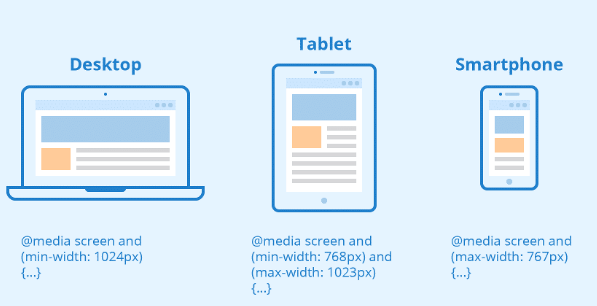
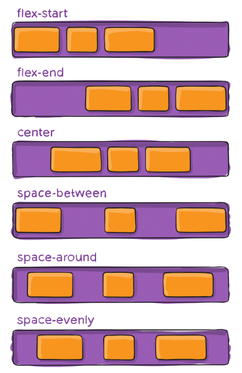
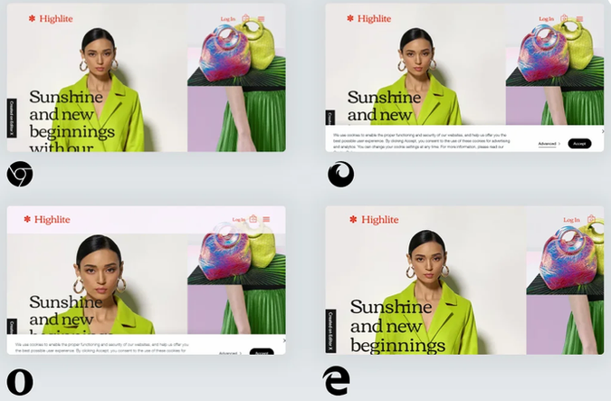
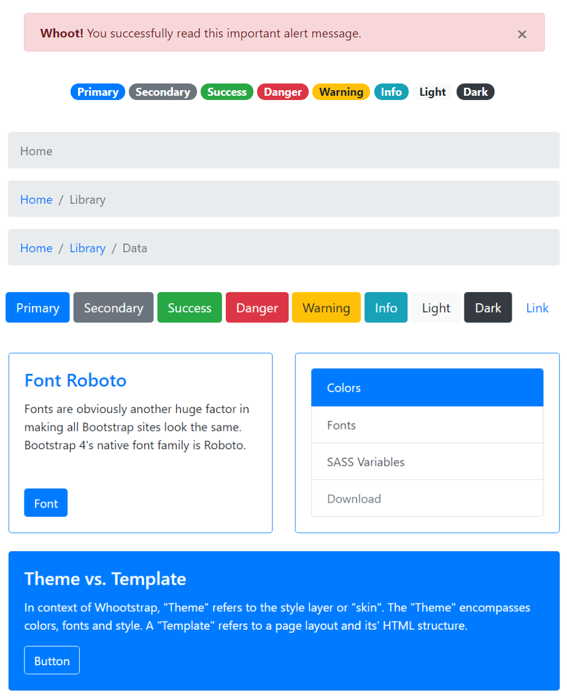
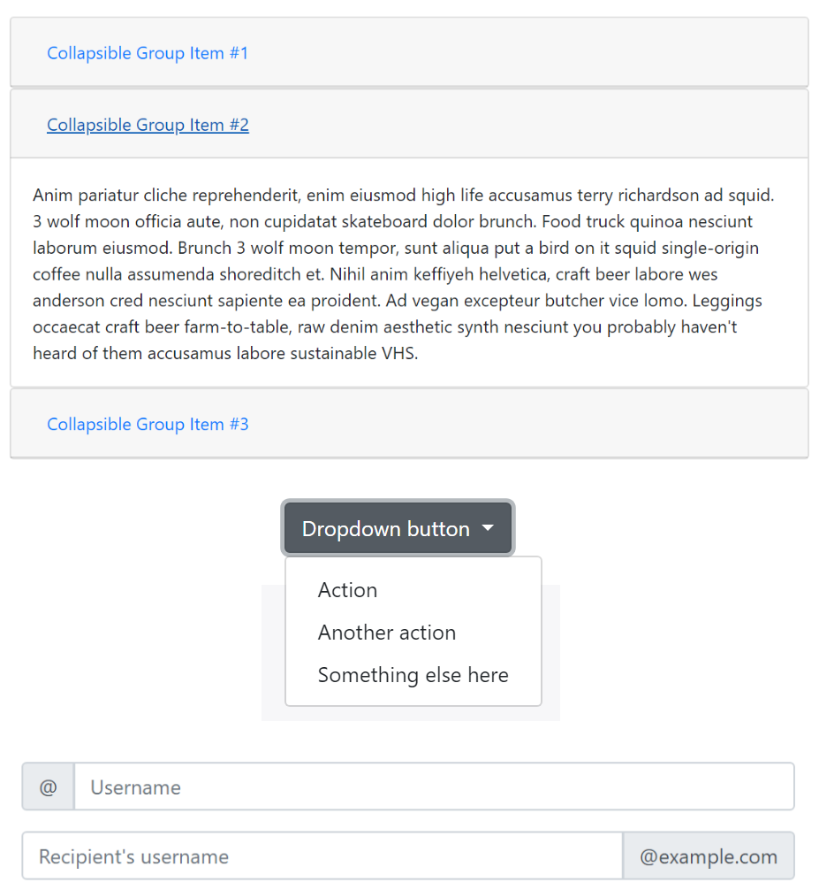
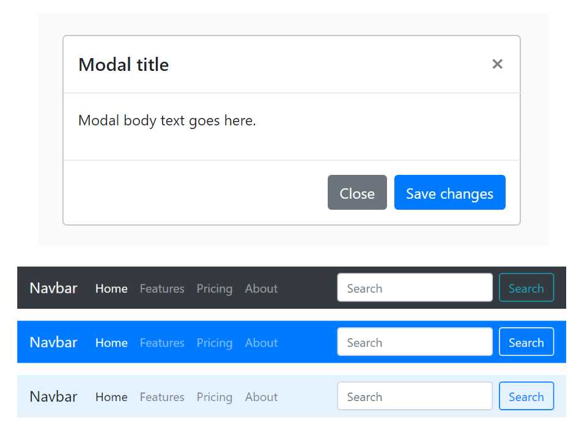

# De opmaak van een webpagina

 

[Hier](/files/cheatsheet_css.pdf) kan je een cheatsheet terugvinden ter ondersteuning van taken, toetsen, projecten en werkplekleren.

**C**ascading **S**tyle **S**heets is een style sheet language die gebruikt wordt om de presentatie van een HTML document te beschrijven.

CSS is ontworpen om het scheiden van presentatie en inhoud van een webpagina mogelijk te maken. Hierdoor is het geheel beter toegankelijk, flexibeler en heeft een een betere controle op de presentatie karakteristieken. Meerdere webpagina's kunnen ook dezelfde opmaak delen door gebruik te maken van eenzelfde .css bestand.

Om beter te begrijpen hoe CSS werkt denk je best rond elk HTML element een kader. Was CSS eigenlijk doet is de opmaak van zo'n kader vastleggen.

## Methoden

### Inline

Inline opmaak gebeurt binnenin de HTML tags. Elke HTML tag kan voorzien worden van een css opmaak.

```html
<body style="background-color: green">
```

Een groot nadeel is dat je voor de volledige website deze opmaak moet herhalen voor elke HTML tag.
Het is dan ook aangeraden deze methode zo weinig mogelijk te gebruiken!

### Internal

Bij deze methode ga je alle opmaak gaan samenbrengen in een style tag bovenaan de HTML pagina.
```html
<style>
    body {
        background-color: green;
    }
</style>
```
Dit is reeds een stukje beter dan de vorige methode, maar voor verschillende pagina's moet je terug die opmaak gaan kopieren wat de kans op fouten aanzienlijk verhoogd.
Probeer ook deze methode zoveel mogelijk te vermijden tenzij je een one-page-website maakt.

### External

Deze methode gebruikt de informatie die in de style-tag stond bij de internal methode en plaatst deze in een .css bestand.
```css
body {
   background-color: green;
}
```
Dit .css bestand moet dan uiteraard gekoppeld worden aan de HTML pagina.

```html
<link rel="stylesheet" type="text/css" href="/styles/style.css">
```

::: warning 'Good-practice'
Het werken met een external CSS file geniet de voorkeur, we zullen voor deze cursus dan ook enkel deze methode toepassen.
:::

::: tip Tip
Als je meerdere stylesheets wil gebruiken en je html code hiermee niet wil overbelasten kan je de link naar jouw master style.css file in je html code plaatsen en vervolgens in je style.css de andere importeren.

```css
@import "/styles/forms.css"

html {
  background-color: #334455;
}
```
:::

## CSS basis

### Opmaak set

Een CSS opmaak set bestaat uit een selector en een definitie blok:


De selector wijst naar het HTML element dat je wil opmaken.

Het definitie blok bevat één of meerdere, door een puntkomma gescheiden, opmaken.
Elk van die opmaken bevat een CSS eigenschap en de waarde ervan gescheiden door een dubbelpunt.
Elke opmaak staat tussen haakjes.

### Commentaar

In CSS start commentaar met een `/*` en eindigt met `*/`. Commentaar kan gerust over meerdere lijnen lopen.

```css
p {
  color: red;
  /* This is a single-line comment */
  text-align: center;
}

/* This is
a multi-line
comment */
```
### Selector
1. De selector selecteert een HTML element op basis van zijn element naam.

    In dit voorbeeld worden alle `<p>` elementen op de pagina gecentreerd en krijgen een rode tekstkleur:
    ```css
    p {
        text-align: center;
        color: red;
    }
    ```
2. De id selector gebruikt het id attribuut van een HTML element een specifiek element te selecteren.

    Een id van een element is uniek in een pagina, dus het wordt gebruikt om één element te selecteren.
    
    Om een element met een specifiek id te selecteren schrijven we een `#` voor de id naam van dit element:
    ```css
    #para1 {
        text-align: center;
        color: red;
    }
    ```
3. De class selector gebruik het class attribuut van een HTML element op dit te selecteren.

    Om een element met een specifieke class te selecteren schrijven we een `.` voor de class naam van dit element:
    ```css
    .center {
        text-align: center;
        color: red;
    }
    ```
4. Gecombineerde selector

    In dit voorbeeld worden enkel `<p>` elementen met de class="center" van een opmaak voorzien:
    ```css
    p.center {
        text-align: center;
        color: red;
    }
    ```
5. Gegroepeerde selector

    Hier worden alle h1, h2, en p elementen van een opmaak voorzien:
   ```css
    h1, h2, p {
        text-align: center;
        color: red;
    }
    ```

6. Pseudo class selector

    De pseudo class selector zal een toestand of relatie van een element selecteren:
    ```css
    a:hover {
      background-color: green;
      color: white;
    }
    ```
7. Pseudo element selector

    Een deel van een element selecteren:
    ```css
    p::first-line {
      font-size: 12px;
    }
    ```

8. Attribuut selector

    Je kan op basis van attribuut waarde iets selecteren:
    ```css
    input[type=button]{
      color: green;
    }
    ```
### Kleur toepassen

We kennen verschillende manieren om kleur toe te passen in CSS:

1. Via de kleurnaam

    Je kan refereren naar een kleur via zijn naam (<a href="https://www.w3schools.com/colors/colors_names.asp" target="_blank">lijst</a>)

    ```css
    h1 {
        background-color: red;
    }
    ```
2. Via de RGB waarde
 
    Je kan naar een kleur refereren via zijn RBG waarde waarbij elke parameter (rood, groen, blauw) een kleurintensiteit tussen 0 en 255 weergeeft.
    
    ```css
    h1{
        color: rgb(60, 179, 113);
    }
    ```
    Door gebruik te maken van **rgba(rood,groen,blauw,alpha)** kan je transparantheid toevoegen. De alpha parameter is een nummer tussen 0.0 (volledig transparant) en 1.0 (totaal niet transparant)

3. Via de hex waarde

    Je kan naar een kleur refereren via zijn hexadecimale waarde **#rrggbb** waarbij rr(rood), gg(groen) en bb(blauw) hexadecimale waarden zijn tussen 00 en FF.

    bv. #ff0000 is weergegeven als rood omdat rr de waarde FF meekreeg terwijl de andere kleuren een waarde 00 kregen.
    ```css
    table{
        color: #6a5acd;
    }
    ```
4. Via de HSL waarde

    Je kan naar een kleur refereren via zijn tint, verzadiging en helderheid **hsl(hue, saturation, lightness)**

    Hue (tint) is het aantal graden op het kleurenwiel van 0 tot 360 waarbij 0 voor rood staat, 120 voor groen en 240 voor blauw.
    
    Saturation (verzadeging) wordt uitgedrukt in percent waarbij 0% een grijstint is en 100% het volle kleur voorstelt.

    Lightness (helderheid) wordt eveneens in percent uitgedrukt waarbij 0% zwart is en 100% wit.

    ```css
    .card{
        background-color: hsl(39, 100%, 50%);
    }
    ```
    Ook hier kan je gebruik maken van **hsla(hue, saturation, lightness, alpha)** om transparentheid toe te voegen.

Als je een specifiek kleur zoekt kan deze [color picker](https://www.w3schools.com/colors/colors_picker.asp) een handige tool zijn.

### Eenheden

Je kan vrij door elkaar onderstaande eenheden gebruiken:


| Eenheid | Type | Relatie | Voorbeeld |
| --- | --- | --- | --- |
| px | absoluut | scherm pixels | p{font-size: 14px} |
| em | percentage | % van parent element font size | p{font-size: 1.2em} |
| rem | percentage | % van root element font size | p{font-size: 0.75rem} |
| % | percentage | % van parent afmeting of font size | .left {width: 20%} |

## CSS eigenschappen

### Background

Naast het aanpassen van de achtergrond kleur van een HTML element kan je ook een afbeelding laden als achtergrond.

* **background-image** : specificeert de afbeelding die als achtergrond moet gebruikt worden. Standaard wordt deze afbeelding herhaalt over het volledige element.
* **background-repeat** : op welke manier die herhaling moet gebeuren.
* **background-position** : op welke positie die afbeelding moet geplaatst worden.
* **background-attachment** : specificeert of de afbeelding met de pagina moet mee scrollen of vast moet staan.
```css
    body {
        background-image: url("/images/img_tree.png");
        background-repeat: no-repeat;
        background-position: right top;
        background-attachment: fixed;
    }
```

### Border

Met de CSS **border** eigenschap kan je de stijl, dikte en kleur van een border instellen.


```css
    p {
        border-style: solid;
    }
```
### Margin

Met de CSS **Margin** eigenschap kan je afstand creëren rond een element buiten de rand van het element.

```css
p {
  margin-top: 100px;
  margin-bottom: 100px;
  margin-right: 150px;
  margin-left: 80px;
}
/* of via de korte notitie */
p {
  margin: 25px 50px 75px;
}
```
### Padding

De CSS **padding** eigenschap doet net hetzelfde als margin maar dan langs de binnenkant van de rand van een element.

```css
div {
  padding-top: 50px;
  padding-right: 30px;
  padding-bottom: 50px;
  padding-left: 80px;
}
/* of via de korte notitie */
div {
  padding: 25px 50px 75px 100px;
}
```


### Height and width

De CSS **height** en **width** eigenschappen leggen zoals je wel kunt vermoeden de hoogte en breedte van een element vast.

De waarde kan je op `auto` plaatsen of uitdrukken in `pixels` of `%`.

```css
div {
  height: 200px;
  width: 50%;
  background-color: powderblue;
}
```
### Text

Naast de kleur kan van nog meerdere eigenschappen van tekst vastleggen.

```css
h1 {
  color: green;
  text-align: center;
  text-decoration: underline;
  text-transform: capitalize;
  text-indent: 50px;
  letter-spacing: 3px;
  line-height: 1.8;
  word-spacing: 10px;
  text-shadow: 3px 2px red;
  font-family: "Times New Roman", Times, serif;
}
```
::: tip Tip
Gebruik steeds `" "` rond tekst met spacies.
:::

### Links

Een hyperlink kan je als volgt stylen:

```css
/* Niet bezochte link */
a:link {
  color: red;
}

/* Bezochte link */
a:visited {
  color: green;
}

/* Mouse over link */
a:hover {
  color: hotpink;
}

/* Geselecteerde link */
a:active {
  color: blue;
}
```

### Lists

Je kan de lijst markering als volgt aanpassen:

```css
ul.a {
  list-style-type: circle;
}

ul.b {
  list-style-type: square;
}

ol.c {
  list-style-type: upper-roman;
}

ol.d {
  list-style-type: lower-alpha;
}
```

of zelfs een afbeelding als markering gebruiken:

```css
ul {
  list-style-image: url('/images/sqpurple.gif');
}
```

### tables

Je kan de opmaak van je tabel als volgt aanpassen:

```css
table {
  border-collapse: collapse;
  width: 100%;
}

th, td {
  border: 1px solid black;
  height: 50px;
  text-align: center;
  vertical-align: bottom;
  padding: 15px;
}
```

### Display

De CSS **display** eigenschap zal bepalen als en hoe een element getoond wordt.

```css
/*maak een blocklevel element inline*/ 
li {
  display: inline;
}
/*maak een inline element blocklevel*/
span {
  display: block;
}
/*verwijder het element*/
h1.hidden {
  display: none;
}
```

### Max-width

De CSS **max-width** eigenschap stelt een maximum breedte in van een element.

```css
div.ex2 {
  max-width: 500px;
  margin: auto;
  border: 3px solid #73AD21;
}
```

### Float

De CSS **float** eigenschap maakt het mogelijk om een element zwevend op te stellen.

```css
/*afbeelding zwevend aan de rechterzijde*/
img {
  float: right;
}
```
::: tip Tip
Als een float element buiten het parent element komt dan kan je dat verhinderen door `overflow: hidden` toe te voegen aan het parent element.
:::

### Berekeningen

Het kan soms handig zijn dat je ipv een vaste waarde te gebruiken die kan berekenen.

```css
ul {
  border: 3px solid black;
  width: calc(100% - 6px);
}
```

## Oefening

::: tip CSS oefening

Maak de oefening op het elektronisch leerplatform en laad die op.

:::

## Take-home opdracht

::: tip Herhaling CSS

Om de nieuwe leerstof nog beter te begrijpen volg je onderstaande videotutorial:

* [CSS Essential Traininng](https://www.linkedin.com/learning/css-essential-training-3) op LinkedIn Learning

Na het volgen van deze online cursus krijg je een certificaat dat je oplaad op het elektronisch leerplatform.

:::


## Responsief webdesign

Responsive design is een methode binnen webdesign die ervoor zorgt dat je webcontent meeverandert met de verschillende afmetingen van schermen van apparaten of vensters op die apparaten.

Zo kan je content op een desktopscherm bijvoorbeeld worden gesplitst in verschillende kolommen, aangezien zo’n scherm breed genoeg is om meerdere kolommen leesbaar weer te geven.

Maar als je dezelfde content in meerdere kolommen op een smartphone wil tonen, kan dit er voor zorgen dat de content voor de bezoekers lastig leesbaar is.

Responsive design maakt het mogelijk om verschillende lay-outs van je content en bijbehorend design af te leveren aan verschillende apparaten, afhankelijk van hun schermgrootte.

### De bouwstenen van responsive webdesign

In dit deel zullen we het hebben over de fundering van responsive webdesign en de verschillende bouwstenen die je daarvoor nodig hebt.

#### CSS en HTML

De basis voor responsive design is de juiste combinatie van HTML en CSS

Zo kan je bijvoorbeeld de breedte van alle HTML afbeeldingen aanpassen per element, op deze manier:

```css
img {
  width: 100%;
}
```

Of we kunnen ons juist richten op een specifieke class, “full-width-img” door vooraf een punt toe te voegen.

```css
.full-width-img {
  width: 100%;
}
```

Je kan het ontwerp ook op andere aspecten bewerken, naast hoogte, breedte en kleur. Door CSS op deze manier te gebruiken maak je een ontwerp responsive, zodra je het combineert met een techniek die “media query” wordt genoemd.

#### Media query’s

Een media query controleert welk apparaat wordt gebruikt en is een belangrijk deel van CSS3. Het is namelijk het onderdeel waarmee je content kan laten weergeven afhankelijk van bepaalde factoren, zoals schermgrootte of resolutie.



Je kan het vergelijken met een “if” clausule die je kan vinden in sommige programmeertalen, aangezien het eigenlijk controleert of het zichtbare deel van een scherm breed genoeg of te breed is, voordat een bepaald stuk code wordt uitgevoerd.

```css
@media screen and (min-width: 780px) {
  .full-width-img {
    margin: auto;
    width: 90%;
  }
}
```

Is het scherm tenminste 780 pixels breed, dan zullen afbeeldingen met de “full-width-img” class 90% van het scherm gebruiken en automatisch gecentreerd worden in gelijke marges aan beide kanten.

#### Fluid lay-outs

Een fluid lay-out (vloeiende lay-out) is een essentieel onderdeel van modern responsive design. In de goede oude tijd kon je een statische waarde voor elke HTML element instellen, bijvoorbeeld 600 pixels.

Een fluid lay-out is echter afhankelijk van dynamische waardes, zoals een percentage van de breedte van het scherm.


Deze methode past dynamisch de grootte van elementen aan op basis van de grootte van het scherm.

#### Flexbox lay-outs

Alhoewel een op percentages gebaseerde lay-out wordt gezien als ‘fluid’, vinden veel designers en webdevelopers dit nog niet dynamisch of flexibel genoeg. Flexbox is een CSS module die is ontworpen als efficiëntere manier om diverse elementen in een lay-out te plaatsen, zelfs wanneer de grootte van de inhoud van een container niet bekend is.

Een flexibele container past de items in de container aan naar gelang de beschikbare ruimte. Deze flex containers hebben een aantal unieke property’s, zoals justify-content, die je niet kan aanpassen bij een normaal HTML element.



Dit is vrij geavanceerd design. Als je dit in je design wil gaan toepassen, raden we je aan om de [CSS Tricks’ flexbox gids](https://css-tricks.com/snippets/css/a-guide-to-flexbox/) te lezen.

#### Responsive afbeeldingen

De meest basale uitvoering van responsive afbeeldingen volgt hetzelfde concept als fluid lay-out, waarbij een dynamische unit wordt gebruikt om de breedte of hoogte in te stellen. Het stukje CSS code dat we eerder al noemde, zorgt hier al voor:

```css
img {
  width: 100%;
}
```

De % unit schat een percentage in van de breedte of hoogte van de viewport en zorgt dat de afbeelding de juiste verhouding heeft voor het scherm.

Het probleem met deze aanpak is dat elke gebruiker de afbeelding op ware grootte moet downloaden, zelfs op mobiele apparaten.

Om verschillende versies voor verschillende apparaten te kunnen leveren, moet je het HTML `srcset` attribuut in je img tags opnemen, zodat je meer dan één afbeeldingsgrootte kan kiezen.

```html

```

### Gebruikelijke limieten voor responsiviteit

Om met media query’s te werken, moet je nadenken over “responsive breakpoints” oftewel limieten voor schermgroottes. Een limiet of breakpoint is de breedte van het scherm waarop je een bepaalde media query gebruikt om nieuwe CSS stijlen te implementeren.

### Gebruikelijke schermgroottes

* Mobiel: 360 x 640
* Mobiel: 375 x 667
* Mobiel: 360 x 720
* iPhone X: 375 x 812
* Pixel 2: 411 x 731
* Tablet: 768 x 1024
* Laptop: 1366 x 768
* High-res laptop of desktop: 1920 x 1080

Kies je voor een mobile-first aanpak, met één kolom en kleinere lettertypen dan de basislay-out, dan hoef je geen mobiele limieten te implementeren, tenzij je het ontwerp wil optimaliseren voor specifieke modellen.


Je kan zodoende een eenvoudig responsive ontwerp maken met slechts twee limieten: één voor tablets en één voor laptops en desktops.

### Zo maak je je website responsive

Nu je de bouwblokken kent, is het tijd om je website responsive te maken.

#### Stel de limieten van je media query in (responsive breakpoints)

Stel de limieten van je media query in op de unieke eisen van je ontwerp. Wil je bijvoorbeeld de Bootstap standaard volgen binnen je ontwerp, dan krijg je de volgende media query’s:

* 576px voor verticale telefoons
* 768px voor tablets
* 992px voor laptops
* 1200px voor grotere apparaten

#### Stel de grootte van elementen in met percentages of maak een CSS Grid lay-out

De eerste en belangrijkste stap is het instellen van verschillende groottes voor de verschillende elementen in de lay-out, afhankelijk van de media query of het limiet van het scherm.

Het aantal lay-out containers dat je hebt, hangt natuurlijk af van je ontwerp, maar de meeste websites focussen op de elementen hieronder:

* Wrapper of container
* Header
* Content
* Zijbalk
* Footer


Met een mobile-first aanpak, kan je eerst de belangrijkste elementen in de lay-out stylen (let op: bevat geen media query voor de eenvoudigste stijl die je gebruikt voor een standaard smartphone in normale stand):

```css
#wrapper {width:95%;  margin: 0 auto; }
#header {width:100%; }
#content {width:100%; }
#sidebar {width:100%; }
#footer {width:100%; }

// Small devices (landscape phones, 576px and up)

@media (min-width: 576px) { ... }

// Medium devices (tablets, 768px and up)

@media (min-width: 768px) {
  #wrapper {width:90%;  margin: 0 auto; }
  #content {width:70%; float:left; }
  #sidebar {width:30%; float:right; }
}

// Large devices (desktops, 992px and up)

@media (min-width: 992px) { ... }

// Extra large devices (large desktops, 1200px and up)

@media (min-width: 1200px) {
  #wrapper {width:90%;  margin: 0 auto; }
}
```

Ga je liever voor percentages, dan beheerst het “float” attribuut aan welke kant van het scherm een element verschijnt: links of rechts.

Wil je verder dan de basis gaan en een responsive design van topkwaliteit maken, dan zul je de CSS flexbox lay-out onder de knie moeten krijgen, inclusief bijbehorende attributen zoals box-sizing en flex.

#### Implementeer responsive afbeeldingen

Een manier om ervoor te zorgen dat er niks misgaat met je afbeeldingen, is het gebruiken van een dynamische waarde voor je afbeelding, zoals we eerder al zagen.

```css
img {
  width: 100%;
}
```

Maar hiermee vraag je nog steeds vrij veel van mobiele bezoekers wanneer ze je website bezoeken.

Let erop dat je altijd een `srcset` gebruikt met verschillende afmetingen van je afbeeldingen, voordat je afbeeldingen toevoegt aan je pagina’s.

Om dit handmatig te doen kost nogal wat tijd, maar met een CMS zoals WordPress wordt dit automatisch gedaan wanneer je mediabestanden uploadt.

#### Responsive lettertypen voor de tekst van je website

De belangrijkste focus van responsive webdesign richt zich vaak op de responsiviteit van de lay-outblocks, elementen en media. Pas daarna denken mensen (misschien) nog eens aan de tekst.

Maar wil je écht goed responsive ontwerp, dan moet je ook de grootte van je lettertype aanpassen zodat deze zich aanpast aan de schermgrootte.

De makkelijkste manier om dit te doen is het instellen van een statische waarde voor de grootte van lettertype, zoals 22 px, en die voor elke media query aan te passen

Je kan tegelijkertijd meerdere tekstelementen targeten door een komma te gebruiken om elementen in een lijst te zetten.

```css
@media (min-width: 992px) {
  body, p, a, h4 {
    font-size: 14px;
  }
}
```

## Cross-browser webdesign

De websites die je maakt, moeten er geweldig uitzien en een sterke indruk achterlaten bij klanten en gebruikers, ongeacht of ze Opera, Chrome, Safari of iets anders gebruiken.

Cross-browser compatibiliteit is een stap die vaak over het hoofd wordt gezien bij het maken van een nieuwe website. Vaak gebruiken de ontwerpers en ontwikkelaars maar één browser om de site te maken en ze controleren hem misschien snel op een handvol andere browsers voordat ze het project als voltooid beschouwen. Dit kan voldoende zijn voor eenvoudige sites die niet bedrijfskritisch zijn, maar als je complexere sites bouwt, kan jouw site er heel anders uitzien op andere browsers.

Natuurlijk is het testen van elke pagina op elke verschillende combinatie van apparaat, platform en browser bijna onmogelijk, en erg kostbaar. Hoe kunnen we er dan voor zorgen dat onze site er op zoveel mogelijk browsers zo uitziet en zich zo gedraagt als we voor ogen hebben?



### Cross-browser compatibiliteit in de hand werken

#### Herhaal jezelf niet

Bij het ontwikkelen van code werk je zoveel mogelijk met externe bestanden voor gelijke code en herhaal je de code niet over en over.
Op die manier moet je bij problemen slechts op één plaats aanpassingen doorvoeren.

#### Definieer een doctype

Aan het begin van je HTML-bestand(en) definieer je de taal waarin de code is geschreven, zodat browsers het correct interpreteren. Bijvoorbeeld, in HTML5 is de doctype declaratie eenvoudigweg:

```html
<!DOCTYPE html>
```

#### Valideer uw code

Foutieve HTML- en CSS-code kan ervoor zorgen dat je website zich in alle browsers op verschillende manieren misdraagt. De bugs kunnen moeilijk te ontdekken zijn en de webpagina zal nog steeds typisch opgebouwd worden met kleine, schijnbaar willekeurige problemen wat het op zijn beurt moeilijk maakt om te debuggen.

Een manier om dit te vermijden is uw code te valideren. Je kunt [HTML](https://validator.w3.org/#validate_by_input+with_options) en [CSS](https://jigsaw.w3.org/css-validator/#validate_by_input) valideren met de W3C validators, of extensies installeren in je IDE die je code controleren terwijl je hem schrijft.

#### Gebruik een CSS reset

Standaard kunnen browsers hun eigen standaard stijlen toepassen op uw website. Chrome past bijvoorbeeld een standaardmarge toe op uw pagina, deze is klein, maar merkbaar als u een donkerdere achtergrondkleur gebruikt.

```css
/*  CSS resetcode */
html, body, div, span, applet, object, iframe,
h1, h2, h3, h4, h5, h6, p, blockquote, pre,
a, abbr, acronym, address, big, cite, code,
del, dfn, em, img, ins, kbd, q, s, samp,
small, strike, strong, sub, sup, tt, var,
b, u, i, center,
dl, dt, dd, ol, ul, li,
fieldset, form, label, legend,
table, caption, tbody, tfoot, thead, tr, th, td,
article, aside, canvas, details, embed, 
figure, figcaption, footer, header, hgroup, 
menu, nav, output, ruby, section, summary,
time, mark, audio, video {
  margin: 0;
  padding: 0;
  border: 0;
  font-size: 100%;
  font: inherit;
  vertical-align: baseline;
}
```

#### Controleer de ondersteuning voor uw CSS eigenschappen

Verschillende browsers ondersteunen niet allemaal dezelfde CSS eigenschappen, wat perfect bruikbaar is in de ene browser bestaat misschien niet in de andere. Bijvoorbeeld, de backdrop-filter eigenschap wordt volledig ondersteund door Chrome, maar is onbestaande in Firefox. Als je erop vertrouwt, dan zal het onverwacht gedrag voor jouw Firefox-gebruikers zijn.

Met tools zoals [Can I Use](https://caniuse.com/) kan je CSS-eigenschappen controleren op hun browserondersteuning. Dit betekent dat je niet veel tijd zult verspillen aan het ontwerpen met een slecht ondersteunde eigenschap, alleen om het later opnieuw te moeten ontwikkelen.

#### Maak responsieve websites

Responsive webdesign zorgt ervoor dat het ontwerp zich aanpast aan elk apparaat waarop het kan worden bekeken, van desktop tot mobiel en alles daartussenin. Het is belangrijk om ervoor te zorgen dat alle functionaliteit mogelijk is en dat alle informatie toegankelijk is op elk apparaat en elke browser, ongeacht de grootte.

#### Zorg voor alternatieven

Er kunnen gevallen zijn waarin we niet kunnen vermijden een eigenschap te gebruiken die niet volledig wordt ondersteund door andere browsers. In dat geval kan het nodig zijn om een alternatief bestand aan te bieden voor specifieke browsers. Bijvoorbeeld:

```html
<link href=”styles.css” rel=”stylesheet”/>
<!--[if lte IE 8]>
 <link href=”ie-styles.css” rel=”stylesheet”/>
<![endif]-->
```

#### Maak gebruik van cloudgebaseerde browsertests

In een ideale wereld zou je in staat zijn om jouw website op veel verschillende apparaten en browsers persoonlijk te testen. Maar in kleinere teams is dit misschien niet mogelijk, dus zou je kunnen kijken naar cloudgebaseerde browsertests waarbij jouw website tegelijkertijd op veel verschillende combinaties van browsers kan worden uitgevoerd. [LambdaTest](https://www.lambdatest.com/),[BrowserStack](https://www.browserstack.com/) en [SmartBear](https://smartbear.com/ppc/testcomplete/web-testing/) bieden allemaal de mogelijkheid om cross-browser compatibiliteit snel en efficiënt te testen.


## Oefening

::: tip Responsief webdesign oefening

Maak de oefening op het elektronisch leerplatform en laad die op.

:::

## Take-home opdracht

::: tip Herhaling Responsief webdesign

Om de nieuwe leerstof nog beter te begrijpen volg je onderstaande videotutorial:

* [The Beginner’s Guide to Responsive Web Design](https://www.youtube.com/watch?v=ACZgsnJIKxc) op YouTube.

Na het volgen van deze online cursus vul je het vragenformulier in op Toledo.

:::

## Gebruik maken van Bootstrap

Bootstrap CSS is het toonaangevende CSS framework voor het ontwikkelen van responsive en mobile-first websites. Deze gratis en open-source toolkit wordt geleverd met een responsive grid systeem, globale CSS instellingen, uitgebreide vooraf gebouwde componenten waaronder knoppen, navigatiebalken en formulieren, en optionele JavaScript plugins om het ontwikkelproces te versnellen.

### Downloaden van Bootstrap

Hiervoor ga je naar [Bootstrap](https://getbootstrap.com/docs/4.6/getting-started/download/) en download je de Compiled versie van Bootstrap. Het Zip-bestand pak je uit in de root van je website en je hermoemt de folder gewoon 'Bootstrap'.

### Laden van Bootstrap

Om Bootstrap te laden ga je op gelijkaardige manier te werk als je eigen CSS bestand.

```html
<link rel="stylesheet" href="bootstrap/css/bootstrap.min.css">
```

Als je ook het Javascript gedeelte van Bootstrap wil gebruiken voeg je volgende toe in de footer van je html.

```html
<script src="https://code.jquery.com/jquery-3.3.1.slim.min.js"></script>
<script src="bootstrap/js/bootstrap.min.js"></script>
```

### Een greep uit de vele Bootstrap componenten 





### Gebruik maken van Bootstrap CSS opmaak

Het gebruik van een van deze Bootstrap componenten is heel eenvoudig. Het is gewoon een kwestie van verwijzen naar de juiste Bootstrap CSS klasse in de HTML markup. Bijvoorbeeld, hier is hoe we Bootstrap's primair gekleurde knop gebruiken op een webpagina...

```html
 <button type="button" class="btn btn-primary">Primary</button>
```
Waarom heeft de button 2 classes  `.btn` en `.btn-primary` ?

Bootstrap's componenten zijn gebouwd met een basis-modifier klasse aanpak. Dit betekent dat het grootste deel van de styling is ondergebracht in een basisklasse (bijv. .btn), terwijl stijlvariaties zijn beperkt tot modifier-klassen (bijv. .btn-primary).

Het principe van Bootstrap is dus vrij eenvoudig, het is alleen in het begin wat uitzoeken welke klasse je precies nodig hebt.

## Gebruik maken van FontAwesome

Het gebruik van pictogrammen in webdesign is een beproefde methode om een website te moderniseren en de gebruikersstroom te sturen. Het toevoegen van pictogrammen aan de inhoud van uw site helpt een gebruiker de informatie die u probeert over te brengen beter te verwerken en biedt een visueel focuspunt dat een gebruiker naar een specifieke sectie leidt.

Grafische pictogrammen kunnen op tal van manieren worden gebruikt om uw webdesignproject meer pit te geven. U kunt ze gebruiken als visuele begeleiding van tekstgebieden of als op zichzelf staande links in situaties waar de ruimte beperkt is en tekstblokken niet haalbaar zijn binnen het ontwerp. Het is deze veelzijdigheid van iconen die ze zo nuttig en wijdverspreid maakt.

Gelukkig is het niet nodig om uw eigen pictogrammenset te maken. Font Awesome biedt een veelzijdig kader dat bijna elke icoonafbeelding bevat die u zich kunt voorstellen, samen met de benodigde schaalbaarheid en aanpassingsmogelijkheden. Font Awesome zal u vrijwel zeker tijd en geld besparen bij uw toepassing van specifieke pictogrammen.

### Laden van FontAswesome

Om FontAwesome te laden ga je terug op dezelfde manier tewerk.

```html
<link rel="stylesheet" href="https://use.fontawesome.com/releases/v5.15.4/css/all.css" type="text/css"/>
```

### Een icoon toevoegen

Laten we als voorbeeld eens het RSS icon toevoegen.

```html
<i class="fa fa-rss"></i>
```

Als je nu de grootte van het icoon wil aanpassen voeg je dit gewoon toe.

```html
<i class="fa fa-rss fa-3x"></i>
```

Het is nu dus kwestie van het gewenste icoon op te zoeken op [FontAwesome](https://fontawesome.com/icons) en de daarbij horende class toe te passen.

## Oefening

::: tip Bootstrap en FontAwesome oefening

Maak de oefening op het elektronisch leerplatform en laad die op.

:::

## Take-home opdracht

::: tip Herhaling Bootstrap & FontAwesome

Om de nieuwe leerstof nog beter te begrijpen volg je onderstaande videotutorial:

* [Bootstrap](https://www.linkedin.com/learning/bootstrap-4-essential-training)

* [Font Awesome](https://www.youtube.com/watch?v=rXiO4bm2Zpc)

Na het volgen van deze online cursus vul je het vragenformulier in op Toledo.

:::

## Publiceren van je website

Je hebt uren gespendeert om je website te bouwen en nu moet die publiek geplaatst worden.
Je hebt hiertoe eerst en vooral een Web Host nodig.

### Een geschikte Web Host zoeken

#### Gedeelde Web Hosts

Je eerste optie is het gebruik van een van de populaire hosting platforms zoals Combell, One, Neostrada en Argeweb. De eigenlijke server waar jouw website is opgeslagen is eigendom van de hosting service en is gedeeld met andere websites.

Gedeelde hosting is een betaalbare optie, maar het heeft ook nadelen zoals langzame pagina laadtijden of downtime. Sommige platforms beperken ook RAM en CPU gebruik, wat kan leiden tot prestatieproblemen voor je website.

#### Managed Web Hosts

Managed hosting, in het kort, betekent dat het hostingbedrijf zoals Nucleus of Hostnet de setup, administratie en het onderhoud van de servers afhandelt.

Managed hosting kost iets meer dan shared hosting, maar de investering betaalt zich altijd terug in termen van betere prestaties, beveiliging, ondersteuning en een verbeterde workload.

#### DIY Host

Een andere optie is om zelf de volledige verantwoordelijkheid voor het configureren, updaten, en onderhouden van jouw website servers op te nemen.

Het klinkt misschien als een goede deal, omdat je niet hoeft te betalen een managed hosting provider. Maar het is veel werk en vereist een grote mate van technische expertise.

Als je niet beschikt over de middelen om regelmatige back-ups, security scans, en ander onderhoud te beheren, DIY hosting is niet voor jou.

### Uploaden bestanden en testen

Nu je een Web Host hebt kan je jou bestanden en folderstructuur uploaden.

Voor je de website effectief publiceert is het verstandig om in een kleine groep of in preview mode de website grondig te testen.

### Publiceren

Het moment van de waarheid, je kan eindelijk de website delen met de wereld.
Je kan nu je domain naam kopen, de webhost configureren en vervolgens publiceren.

Iedereen kan nu je website raadplegen maar daarom is hij nog niet direct vindbaar.
Het is nu kwestie van je website te registreren bij zoekmachines.

Om je website bij Google in te dienen, gebruik je [Google Search Console](https://search.google.com/search-console/welcome?utm_source=about-page), en verifieer je de eigendom van de website.

1. Ga naar Google Search Console en log in met je google account (als je nog niet bent ingelogd via Google Chrome).
2. Voeg nu je domainnaam toe
3. Om te bewijzen dat je eigenaar bent van dit domain gebruik je gewoon het DNS TXT record.
