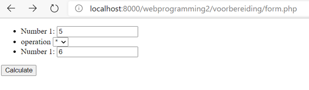
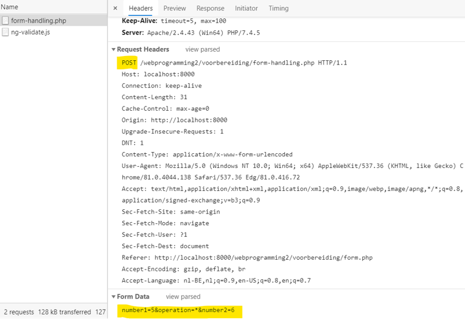

# Week 3 - Gebruik van Forms met PHP

## HTTP Request

**HTTP GET** : Er gebeuren geen wijzigingen op de server.

* De data zit in de url geëncodeerd bv `http://...?a=2&b=test`
* De browser geeft geen waarschuwing als je de pagina herlaadt en de GET dus nogmaals uitvoerd.
* De data is dus leesbaar in de URL, bijgevolg is dit geen geschikte manier om gevoelige informatie door te sturen.
* De lengte van een URL is beperkt, bijgevolg ook de hoeveelheid data dat je kan doorsturen.

**HTTP POST** : De server ontvangt data en doet een wijziging, bv de ontvangen data toevoegen aan een database.

* De data wordt meegstuurd in 'content' van de HTTP POST
* De browser geeft een waarschuwing als je de pagina herlaadt en de POST nogmaals zou gebeuren.
* Een HTTP POST wordt meestal uitgevoerd door een FORM met als ACTION POST
* Deze methode is meer geschikt om gevoelige data te versturen.
* Je kan veel meer data op die manier versturen.

Meer informatie hierover kan je terugvinden op [developer.mozilla.org](https://developer.mozilla.org/en-US/docs/Web/HTTP/Methods/POST)

## Laten we dit even toepassen in een voorbeeld

We maken een bestand `form.php` met volgende inhoud:

```php
<!DOCTYPE html>
<html lang="en">
    <head>
        <meta charset="UTF-8">
        <meta name="viewport" content="width=device-width, initial-scale=1.0">
        <title>Form</title>
    </head>
    <body>
        <form action="./form-handling.php" method="post">
            <ul>
                <li>
                    <label for="number1">Number 1:</label>
                    <input type="number" id="number1" name="number1">
                </li>
                <li>
                    <label for="operation">operation</label>
                    <select id="operation" name="operation">
                        <option value="+">+</option>
                        <option value="-">-</option>
                        <option value="*">*</option>
                        <option value="/">/</option>
                    </select>
                </li>
                <li>
                    <label for="number2">Number 2:</label>
                    <input type="number" id="number2" name="number2">
                </li>
            </ul>
            <button type="submit">Calculate</button>
        </form>
    </body>
</html>
```
We kiezen dus duidelijk voor een POST methode bij de ACTION van deze form.

Onze form ziet er als volgt uit:



Als je in Chrome de ontwikkelomgeving opent [F12] en naar het tabblad `netwerk` gaat kan je volgen welke informatie wordt verstuurd:



De afhandeling hiervan gebeurt in het bestand `form-handling.php` met volgende inhoud:

```php
<!DOCTYPE html>
<html lang="en">
    <head>
        <meta charset="UTF-8">
        <meta name="viewport" content="width=device-width, initial-scale=1.0">
        <title>form handling</title>
    </head>
    <body>
        <?php
            // parameters uit content halen
            $number1 = (float) ($_POST['number1'] ?? 0); 
            $operation = $_POST['operation'] ?? '+'; 
            $number2 = (float) ($_POST['number2'] ?? 0); 

            // berekening uitvoeren
            switch ($operation) {
                case '+':
                    $result=$number1+$number2;
                    break;
                case '-':
                    $result=$number1-$number2;
                    break;
                case '*':
                    $result=$number1*$number2;
                    break;
                case '/':
                    $result=$number1/$number2;
                    break;
                default:
                    # code...
                    break;
            }

            // het resultaat weergeven
            echo "{$number1} {$operation} {$number2} is {$result}";
        ?>
    </body>
</html>
```

We kunnen de doorgekregen gegevens uit de content halen met de superglobal `$_POST`. Als je echter de pagina herlaadt krijg je een error, door met de operator ?? te werken kan je dit omzijlen.

Als we dit nu allemaal op één pagina willen kunnen we dit doen door te controleren of we een POST request ontvangen. 

Dit ziet er dan als volgt uit:

```php
<!DOCTYPE html>
<html lang="en">
    <head>
        <meta charset="UTF-8">
        <meta name="viewport" content="width=device-width, initial-scale=1.0">
        <title>Single page form</title>
    </head>
    <body>
        <form action="./form-single-page.php" method="post">
            <ul>
                <li>
                    <label for="number1">Number 1:</label>
                    <input type="number" id="number1" name="number1">
                </li>
                <li>
                    <label for="operation">operation</label>
                    <select id="operation" name="operation">
                        <option value="+">+</option>
                        <option value="-">-</option>
                        <option value="*">*</option>
                        <option value="/">/</option>
                    </select>
                </li>
                <li>
                    <label for="number2">Number 1:</label>
                    <input type="number" id="number2" name="number2">
                </li>
            </ul>
            <button type="submit">Calculate</button>
        </form>
        <?php
            if($_SERVER['REQUEST_METHOD']=='POST')
            {
                $number1 = (float) ($_POST['number1'] ?? 0); 
                $operation = $_POST['operation'] ?? '+'; 
                $number2 = (float) ($_POST['number2'] ?? 0); 
                switch ($operation) {
                    case '+':
                        $result=$number1+$number2;
                        break;
                    case '-':
                        $result=$number1-$number2;
                        break;
                    case '*':
                        $result=$number1*$number2;
                        break;
                    case '/':
                        $result=$number1/$number2;
                        break;
                    default:
                        # code...
                        break;
                }
                echo "{$number1} {$operation} {$number2} is {$result}";
            }
        ?>
    </body>
</html>
```

## Project

::: tip Deel 3

Voer deel 3 (Form) van het project uit.

:::

## Take-home opdracht

::: tip Voorbereiding PHP en MySql

Om de leerstof van de volgende les nog beter te begrijpen bekijk je alvast hoofdstukken 5 t.e.m. 9 van de videotutorial [PHP with mySQL essential training 1 the basics](https://www.linkedin.com/learning/php-with-mysql-essential-training-1-the-basics) op LinkedIn Learing

:::