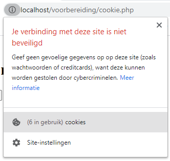
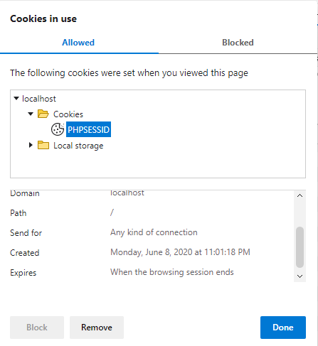
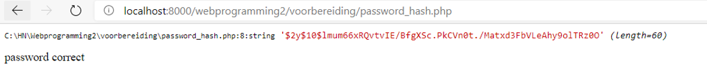
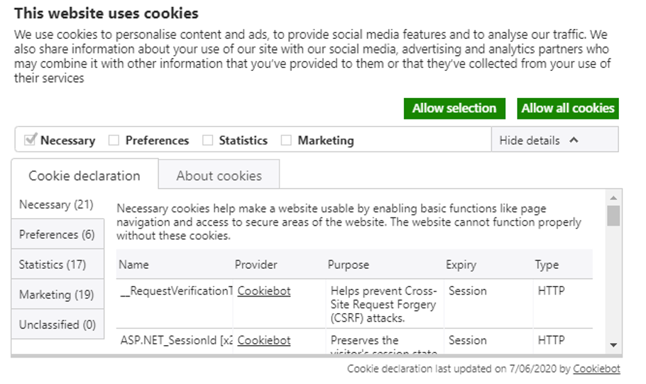

# Week 6 - PHP en cookies & sessions

## Cookie

Een **cookie** is dus een klein blokje data (tot 4096 bytes) wat de server bij een eerste HTTP Response meestuurt naar de client browser. Deze client browser zal op zijn beurt bij elke volgende HTTP request deze cookie eveneens meesturen naar de server.

Initieel is dit ontworpen om te kunnen bijhouden wie je bent en wat er in jou winkelmandje zit.

Bij de aanmaak van de cookie krijgt deze een naam, een value en een houdbaarheidsdatum (aantal seconden vanaf 1970).

In PHP kunnen we bij een HTTP request kijken of een cookie werd meegestuurd, indien deze niet aanwezig is kan je als volgt een default waarde gebruiken:

```php
$language=$_COOKIE['lang']??'English';
```
Als je een cookie wil wissen kan je dit eenvoudig doen daar een value = false in te stoppen. Dat betekend ook dat je geen boolean als value van een cookie kan gebruiken maar met 0 of 1 moet werken.

Een cookie wordt bij de client bewaard, deze kan dus hier wijzigingen aan aanbrengen, hierdoor is een cookie minder veilig.

### Laten we een voorbeeld bekijken

We werken een webpagina uit met een taalkeuze:

```php
<?php
    // Indien cookie niet bestaat gebruik 'English' als default taal
    $language=$_COOKIE['lang']??'English';
    // Is er via de form een post 'lang' doorgestuurd?
    if(isset($_POST["lang"]))
    {
        // Maak de cookie aan met de doorgekregen waarde met een houdbaarheid van 5 uur.
        setcookie('lang',$_POST['lang'],time()+60*60*5);
        // Zet de taal juist
        $language=$_POST['lang']; 
        // debug de ontvangen taalkeuze
        echo '<div> POST: '.($_POST['lang']??'post variabele not set').'</div>';
    }
    // debug de cookie waarde
    echo '<div> COOKIE: '.($_COOKIE['lang']??'cookie not set').'</div>';
    // Afhankelijk van de taalkeuze toon je de header in de juiste taal
    if($language=='English')
    {
        echo '<h1>Hello World</h1>';
    }
    else {
        echo '<h1>Hallo Wereld</h1>';
    }
?>

// De taalkeuze form
<form method="post">
    <select name="lang">
        <option value="English">English</option>
        <option value="Dutch">Dutch</option>
    </select>
    <button>Submit</button>
</form>
```

Je kan zelf in je browser de gebruikte cookies inspecteren. In Chrome ga je bv naar het informatie icoontje net voor de URL balk en kies je cookies.



## Session

Een **session** is een soort cookie met een id. Iedere client krijgt een uniek id die zolang geldig blijft als het browservenster open staat. Op de server wordt een file bewaard met dit id waarin dan alle data zit voor deze client. Dit is eerst en vooral veel veiliger omdat de client deze data niet kan wijzigen en veel efficienter omdat bij elke HTTP request/response enkel de session identifier moet meegestuurd worden.

### laten we een voorbeeld bekijken

```php
<?php
    // Maak de session identifier aan
    session_start();
    // Gebruik een default waarde indien nodig
    $comment=$_SESSION['comment']??'no comment';
    // Is er via de form een post 'comment'doorgestuurd?
    if(isset($_POST["comment"]))
    {
        // Bewaar de 'comment' data in de session
        $_SESSION['comment']=$_POST['comment'];
        // Debug de ontvangen comment    
        echo '<div> POST: '.($_POST['comment']??'post variabele not set').'</div>';
    }
    // Debug de session comment waarde
    echo '<div> SESSION: '.($_SESSION['comment']??'session not set').'</div>';
?>

// De comment form
<form method="post">
    <input type="text" name="comment" />
    <button>Submit</button>
</form>
```
Als we ditmaal de cookies inspecteren in onze browser stellen we vast dat er slechts 1 cookie aanwezig is met de naam PHPSESSID met jou unieke indentifier voor deze sessie.



## Login pagina

Om bij te houden als een gebruiker ingelogd is moet je dit steeds doen via een session variabele. Mocht je dit doen via een cookie kan de gebruiker eventueel de cookie manupuleren en zo het doen lijken alsof hij ingelogd is zonder echt ooit een gebruikersnaam en paswoord in te geven.

Een basis loginsysteem ziet er als volgt uit:

```php
<?php
    session_start();                                    // Start or renew the session
    $logged_in = $_SESSION['logged_in'] ?? false;       // Is the user logged in?
    
    $email = 'evy.bucket@outlook.com';                  // Email to log in
    $password = 'password';                             // Password to log in

    function login(){                                   // After succesfull login
        session_regenerate_id(true);                    // Update session ID
        $_SESSION['logged_in'] = true;                  // Set logged_in key to true
    }

    function logout(){                                  // Terminate the session
        $_SESSION = [];                                 // Clear contents of session array
        $params = session_get_cookie_params();          // Get the session cookie parameters
        setcookie('PHPSESSID', '', time() - 3600,       
                   $params['path'],
                   $params['domain'],
                   $params['secure'],
                   $params['httponly']);                // Delete session cookie
        session_destroy();                              // Delete session file
    }

    function require_login($logged_in){                 // Check if users is logged in
        if($logged_in == false) {                       // If user is nog logged in
            header('Location: login.php');              // Redirect to login.php
            exit;                                       // Stop executing rest of this page
        }
    }
?>
```

Die gebruikersnaam en paswoord worden bij registratie bewaard in een database. Om er voor te zorgen dat een paswoord veilig bewaard is in een database moet deze versleuteld worden. Doe je dit niet dan kan een hacker eenmaal toegang gekregen tot jou database met alle gebruikersnamen en paswoorden aan de slag.

::: danger Waarschuwing
Het is bij wet verplicht om paswoorden versleuteld te bewaren. Hier staan zeer hoge boetes op!
:::

Om een paswoord te versleutelen gebruiken we een **hash-functie** deze gebruikt een algoritme (naar keuze) om het paswoord om te vormen in een niet leesbare reeks van karakters. Waarbij het eerste deel het algoritme bevat.

Het is onmogelijk om vanuit de hash het paswoord te berekenen. Bij gevolg moet je het ingebrachte paswoord met het zelfde algoritme versleutelen en dan deze vergelijken met de in de database bewaarde hash.

### Laten we even een voorbeeld bekijken

```php
<?php
    // bij wijze van oefening gebruiken we twee variabelen i.p.v. een input en database
    $password="secretpassword";
    $password_input="secretpassword";
    // We versleutelen het paswoord via het algoritme PASSWORD_DEFAULT
    $hash=password_hash($password,PASSWORD_DEFAULT);
    // Debug van de hash
    var_dump($hash);
    //gebruik password_verify => algoritme die moet gebruikt worden zit in de eerste bytes van de hash
    if(password_verify($password_input, $hash)){
        echo "<div>password correct</div>";
    }
    else {
        echo "<div>password wrong </div>";
    }
 ?>
```



## Wetgeving

Laten we eerst even [deze video](https://www.youtube.com/watch?v=QWw7Wd2gUJk) bekijken om beter te begrijpen wat het probleem met cookies is.

### GDPR

Bedrijven hebben het recht om de persoonsgegevens van gebruikers te verwerken indien ze **toestemming kregen** of ze een **legitiem belang** (bvb om fraude te vermijden) hebben. 

### ePrivacy Regulation

Dit is een uitbreiding op de GDPR wetgeving die binnenkort van kracht komt:

* toegang tot websites niet verbieden indien cookies gebruik niet werd goedgekeurd
* wifi locatie en device tracking
* privacy setting van de browsers standaard aan
* regulatie van de inhoud van de metadata (cookies)

### Klassificatie

Cookies vallen onder volgende klassificatie:

**Duration (duur)**

* session cookies: tijdelijk en verdwijnen als je de browser sluit
* persistent cookies: alle overige cookies => volgens ePrivacy Directive maximaal 12 maanden

**Provenance (oorsprong)**

* first-party cookies: de cookies die door de website die je bezoekt worden geplaatst
* third-party cookies: deze geplaatst door een third party zoals advertiser (ads) of een analytic systeem 

**Purpose (doel)**

* strictly necessary cookies: bijvoorbeeld om in te loggen, inhoud winkelmand
* preference cookies (functioniality cookies): keuzes zoals taal, username en automatisch inloggen
* statistics cookies (performance cookies): tellers, hoe de website werd gebruikt, ... Maar anoniem gemaakt, niet meer terug te leiden naar een persoon
* marketing cookies: volgen je online activiteit en helpen adverteerders doelgerichter te adverteren, meestal third-pary en persistent

### Cookie richtlijnen

* gebruikers dienen toestemming te geven vooraleer cookies te gebruiken, uitgezonderd de noodzakelijke cookies(strictly necessary cookies)
* de gebruiker informeren welke data elke cookie precies volgt, en dit vooraleer toestemming werd verkregen
* de toestemmingen van de gebruikers documenteren en bewaren
* de gebruikers toelating geven om je service te gebruiken, zelfs indien ze geen toestemming gaven voor bepaalde cookies
* de gebruikers de mogelijkheid geven om hun toestemming terug in te trekken

Een mooi voorbeeld is [Cookiebot](https://www.cookiebot.com/en/cookie-consent).



## Klasopdracht

::: tip Back-end IoT applicatie

Verder werken aan de info pagina van de klassikale opdracht

:::