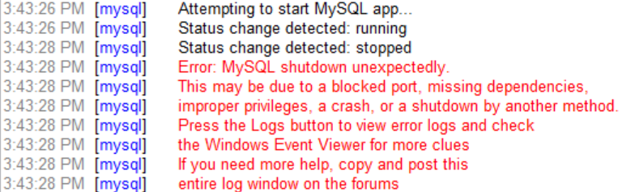

# Troubleshooting

::: details Mijn MySQL server wil niet meer opstarten

De precieze oorzaak kon ik nog niet achterhalen, maar soms loopt er iets fout tijdens het afsluiten van de MySQL server. Hierdoor lukt het opstarten de volgende keer niet meer.



**Work-around**

1. Ga naar de folder `C:\xampp\mysql` en maak er een nieuwe folder `FIX_BACKUP` aan.
2. Kopier de folders `C:\xampp\mysql\backup` en `C:\xampp\mysql\data` naar de nieuwe folder `C:\xampp\mysql\FIX_BACKUP`.
3. Kopier de inhoud van de folder `C:\xampp\mysql\backup` naar de folder `C:\xampp\mysql\data` waarmee je alle bestanden overschrijft.
4. Kopier het bestand `ibdata1` uit de folder `C:\xampp\mysql\FIX_BACKUP\data` naar `C:\xampp\mysql\data` waarmee je het bestand ook terug overschrijft.

Nu zou de MySQL server terug moeten opstarten.

Start nu phpMyAdmin op en voer onderstaande sql-statement uit om onze gebruiker terug toe te voegen :

```sql
CREATE USER 'webuser'@'localhost' IDENTIFIED BY "secretpassword";
GRANT ALL PRIVILEGES ON vives.* TO 'webuser'@'localhost';
```

:::